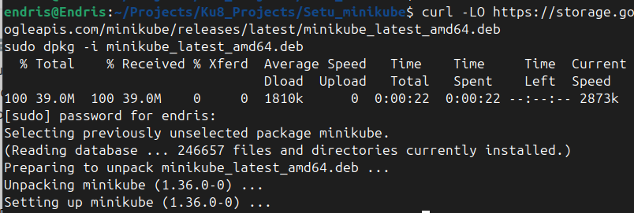
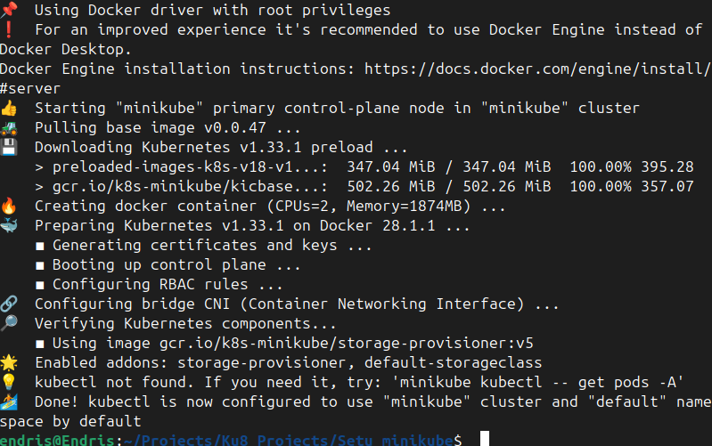
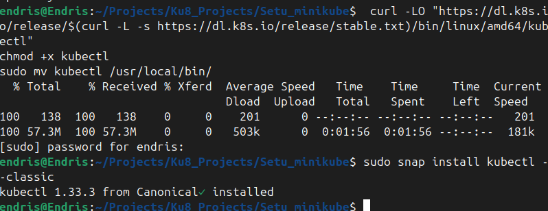

# Minikube Kubernetes Setup on Linux

## 📌 Project Overview

This project introduces Kubernetes and demonstrates how to set up a local Kubernetes cluster using **Minikube** on a Linux machine. It also provides hands-on experience with Docker and deploying applications on Kubernetes.

---

## 🎯 Project Goals

By the end of this project, you will:

- Understand Kubernetes core components and architecture.
- Install and configure Minikube on a Linux system.
- Use Docker to build and manage containerized apps.

---

## 🧠 Understanding Kubernetes

Kubernetes is an open-source platform for automating deployment, scaling, and operation of application containers. It abstracts the underlying infrastructure and provides features such as:

- Automated load balancing
- Rolling updates
- Self-healing of failed applications

### Key Components

| Component          | Description                                             |
| ------------------ | ------------------------------------------------------- |
| Control Plane      | Master node that manages cluster state and scheduling   |
| Nodes              | Worker machines where Pods run                          |
| Pods               | Smallest deployable unit; holds one or more containers  |
| Containers         | Packages app and dependencies for consistent execution  |
| API Server         | Exposes Kubernetes API; front-end for the control plane |
| Scheduler          | Assigns Pods to appropriate nodes                       |
| Controller Manager | Reconciles cluster state with desired state             |
| etcd               | Distributed key-value store for config/state            |
| Kubelet            | Ensures Pods are running on a node                      |
| Kube Proxy         | Handles networking between Pods and Services            |

---

## 🧪 What is Minikube?

Minikube is a lightweight tool to run a Kubernetes cluster locally on your machine for testing and development.

---

## 🖥️ Installing Minikube on Linux

### 1. 🐳 Install Docker

Minikube uses Docker to create and manage containerized environments. I have docker installed on my system. If you don't have Docker installed, follow these steps:

```bash
sudo apt-get update
sudo apt-get install ca-certificates curl gnupg
sudo install -m 0755 -d /etc/apt/keyrings
curl -fsSL https://download.docker.com/linux/ubuntu/gpg | sudo gpg --dearmor -o /etc/apt/keyrings/docker.gpg
sudo chmod a+r /etc/apt/keyrings/docker.gpg
echo \
  "deb [arch=\"$(dpkg --print-architecture)\" signed-by=/etc/apt/keyrings/docker.gpg] https://download.docker.com/linux/ubuntu \
  $(lsb_release -cs) stable" | sudo tee /etc/apt/sources.list.d/docker.list > /dev/null
sudo apt-get update
sudo apt-get install docker-ce docker-ce-cli containerd.io
```


### 2. 📥 Install Minikube

```bash
curl -LO https://storage.googleapis.com/minikube/releases/latest/minikube_latest_amd64.deb
sudo dpkg -i minikube_latest_amd64.deb
```

> 

### 3. 🚀 Start Minikube

```bash
minikube start --driver=docker
```

>

### 4. 🛠️ Install kubectl

```bash
curl -LO "https://dl.k8s.io/release/$(curl -L -s https://dl.k8s.io/release/stable.txt)/bin/linux/amd64/kubectl"
chmod +x kubectl
sudo mv kubectl /usr/local/bin/
```

> 

---

## 🧹 Cleanup

To stop and remove your Minikube cluster:

```bash
minikube stop
minikube delete
```

>
