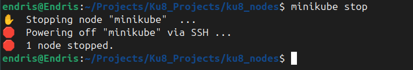

# Working with Kubernetes Nodes


## Introduction

Now that we have our Minikube cluster setup, let's dive into managing nodes in Kubernetes.

## What Is a Node?

In Kubernetes, think of a node as a dedicated worker — like a dependable employee in an office — responsible for executing tasks and hosting containers to ensure seamless application performance.

A **Kubernetes Node** is a physical or virtual machine that runs the Kubernetes software and serves as a worker machine in the cluster. Nodes are responsible for running **Pods**, which are the basic deployable units in Kubernetes. Each node in a Kubernetes cluster typically represents a single host system.


## Managing Nodes in Kubernetes

Minikube simplifies Kubernetes management for development and testing. Below are common node-related operations using Minikube.

### Start Minikube Cluster

This command starts a local Kubernetes cluster using a single-node Minikube setup:

```bash
minikube start
```


### Stop Minikube Cluster

Preserves state and stops the current local Kubernetes cluster:

```bash
minikube stop
```



### Delete Minikube Cluster

Completely removes the cluster and all associated resources:

```bash
minikube delete
```


### View Nodes

Lists all the nodes in your Kubernetes cluster:

```bash
kubectl get nodes
```


### Inspect a Node

Provides detailed information about a specific node:

```bash
kubectl describe node <node-name>
```


## Node Scaling and Maintenance in Minikube

### Node Scaling (Concept)

Minikube usually runs as a single-node cluster, so scaling is limited. However, understanding this is useful for larger environments.


### Node Upgrade

You can upgrade your local cluster to a new Kubernetes version:

```bash
minikube start --kubernetes-version=<version>
```

Example:

```bash
minikube start --kubernetes-version=v1.29.0
```

## Summary

By effectively managing nodes in a Minikube Kubernetes cluster, you can simulate a production-like environment locally for:

* Debugging
* Development
* Experimentation

This keeps your local workflow in sync with real-world Kubernetes behavior.

---
