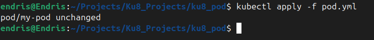
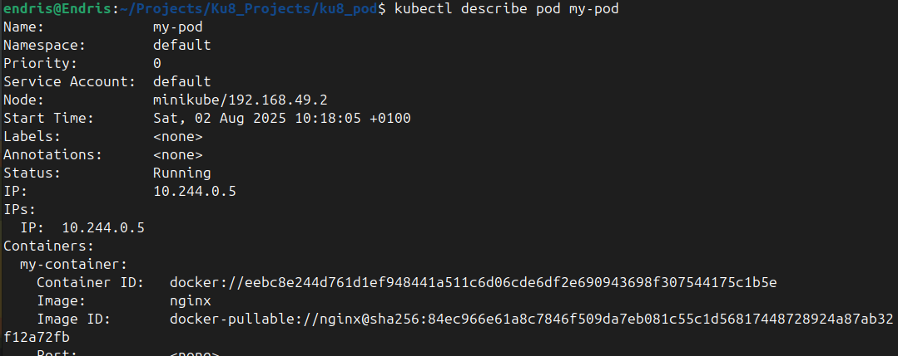
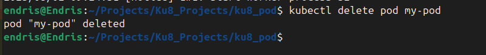
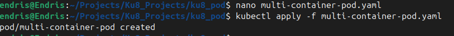

# Working with Kubernetes Pods

## 📌 Pods in Kubernetes

### 🧾 Definition and Purpose

A **Pod** in Kubernetes is the smallest deployable unit and represents a group of one or more containers that share:

* Network (IP address and port space)
* Storage (volumes)
* Lifecycle

These containers are tightly coupled and run together on the same node. In **Minikube**, Pods are fundamental for deploying and testing containerized applications locally.

---

## 🛠️ Creating and Managing Pods

### 1. **Create a Pod using YAML**

Define your Pod in a YAML file (e.g., `pod.yaml`):

```yaml
apiVersion: v1
kind: Pod
metadata:
  name: my-pod
spec:
  containers:
  - name: my-container
    image: nginx
```

Apply it:

```bash
kubectl apply -f pod.yaml
```

📸 

---

### 2. **List All Pods**

```bash
kubectl get po -A

```

📸 

---

### 3. **Inspect a Pod**

```bash
kubectl describe pod my-pod
```

📸 

---

### 4. **View Pod Logs**

```bash
kubectl logs my-pod
```

📸 

---

### 5. **Delete a Pod**

```bash
kubectl delete pod my-pod
```

📸 

---

## 📦 Containers in Kubernetes

### 🔍 Definition and Purpose

A **container** is a lightweight, isolated, and executable package that contains the application code along with its dependencies. In Kubernetes, **containers run inside Pods**.

Minikube helps simulate real-world environments by letting you deploy containers within Pods, ideal for local development.

---

### 🧱 Defining Containers Inside Pods

Define a Pod with one or more containers in a YAML file:

```yaml
apiVersion: v1
kind: Pod
metadata:
  name: multi-container-pod
spec:
  containers:
  - name: nginx-container
    image: nginx
  - name: busybox-container
    image: busybox
    command: ['sh', '-c', 'echo Hello from BusyBox && sleep 3600']
```

Apply it:

```bash
kubectl apply -f multi-container-pod.yaml
```

📸 

---

### Conclusion

By understanding and practicing with Pods and Containers in Minikube, you gain hands-on experience with Kubernetes’ core deployment unit. This knowledge is foundational for building scalable, resilient applications in real-world Kubernetes clusters. 
