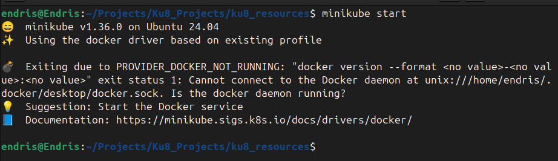
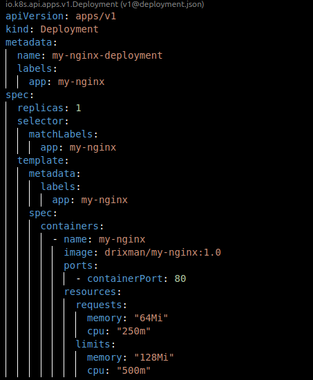
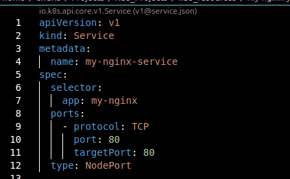
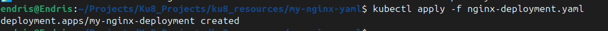
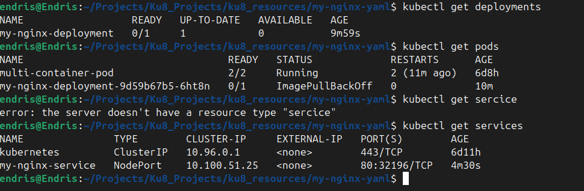
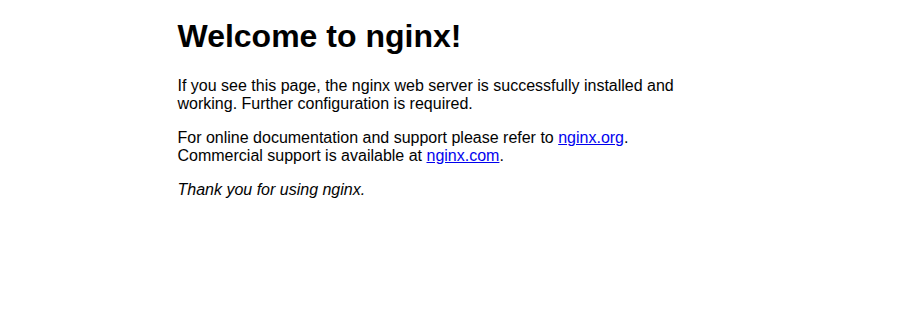

# Working with Kubernetes Resources

This hands-on project demonstrates how to deploy and expose an Nginx web application on Minikube using Kubernetes YAML configuration files.

---

## 1. Introduction to YAML

A **Kubernetes YAML file** is a text file written in YAML syntax that describes and defines Kubernetes resources such as Pods, Containers, Services, and Deployments.  
YAML uses indentation to represent hierarchy and spaces (not tabs) for indentation. In Kubernetes, YAML provides a declarative way to specify the desired state of resources.

---

## 2. Basic Structure of a YAML File

- **Scalars**: Single values such as strings, numbers, booleans.
- **Collections**:
  - Lists (arrays)
  - Maps (key-value pairs)
- **Nested Structures**: Allows hierarchy.
- **Comments**: Start with `#`.
- **Multiline Strings**: Represented with `|` or `>`.
- **Anchors & Aliases**: `&` to create an anchor, `*` to use it.

---

## 3. Deploying Applications in Kubernetes

Deployments in Kubernetes define the desired state of an application, including scaling and update strategies.  
Services provide a stable endpoint for accessing Pods.

Types of Services:
- **ClusterIP** – Accessible only inside the cluster.
- **NodePort** – Accessible externally on a static port.
- **LoadBalancer** – Uses cloud provider load balancer for external access.

---

## 4. Start Minikube

```bash
minikube start
````



---

## 5. Create Project Directory

```bash
mkdir my-nginx-yaml
cd my-nginx-yaml
```


---

## 6. Create Deployment YAML

see **File:** `nginx-deployment.yaml` artifact



---

## 7. Create Service YAML

see **File:** `nginx-service.yaml` artifact



---

## 8. Apply Deployment

```bash
kubectl apply -f nginx-deployment.yaml
```



---

## 9. Apply Service

```bash
kubectl apply -f nginx-service.yaml
```


---

## 10. Verify Resources

```bash
kubectl get deployments
kubectl get pods
kubectl get services
```



---

## 11. Access Application

```bash
minikube service my-nginx-service
```

This opens the Nginx welcome page in a browser.



---

## 12. Push Project to GitHub

```bash
git add .
git commit -m "Kubernetes Nginx Deployment and Service"
git branch -M main
git remote add origin <your-repo-url>
git push -u origin main
```

---

## Project Structure

```
my-nginx-yaml/
│
├── nginx-deployment.yaml
├── nginx-service.yaml
├── img/
│   ├── yaml-introduction.png
│   ├── yaml-structure.png
│   ├── kubernetes-services.png
│   ├── start-minikube.png
│   ├── create-folder.png
│   ├── create-deployment-yaml.png
│   ├── create-service-yaml.png
│   ├── apply-deployment.png
│   ├── apply-service.png
│   ├── verify-resources.png
│   ├── nginx-browser.png
│   └── push-to-git.png
└── README.md
```
## Challenges Faced and Resolution
While attempting to run minikube service, the command failed because the Dockerfile was missing from the project directory.
To resolve this, I created a Dockerfile inside the nginx-project folder, built the image from it, and then pushed the image to Docker Hub.
After updating the Kubernetes deployment to use this image, minikube service executed successfully.

## Conclusion
This project demonstrated how to deploy and expose an application using Kubernetes Pods in Minikube.
A key takeaway was ensuring that all necessary build files, such as the Dockerfile, are present before attempting deployment. This not only ensures smooth execution but also prevents unnecessary troubleshooting during the deployment process.

